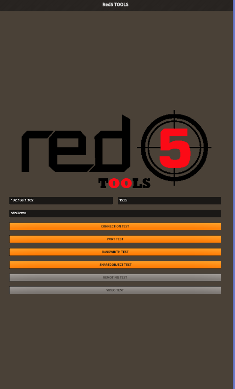

# red5-mobile-tester

Red5 tools is a collection of tests that can be run against your red5 media server application from your android device to check server availability, port status, bandwidth etc.

You can perform the following tests on your red5 media server.

1. Connection test
2. Port test
3. Bandwidth test
4. Shared Object test

5. Video test (coming soon)
6. Remoting test (coming soon)

Note: Although the application is meant to be used with Red5 media server, you cal also use it with any other rtmp media server. Some of the test may not work as expected for other media servers.

# Development environment

FlashDevelop
Flex SDK >= 4.6.0
AIR 19 SDK
Starling framework
Feathers UI components

# Screenshots

